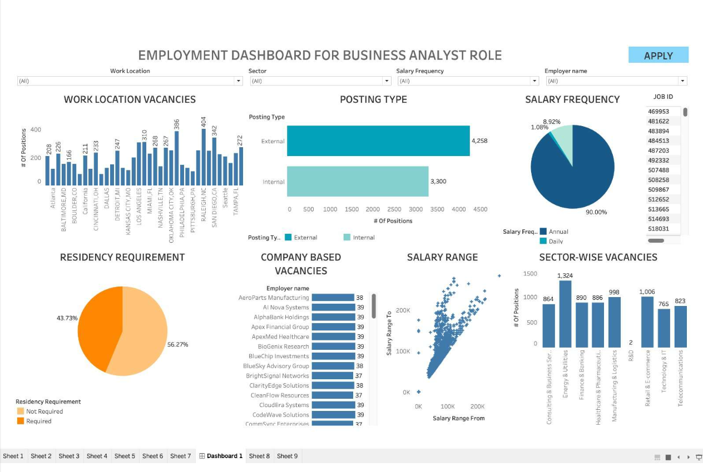

#   Business Analyst Job Finder

 Your gateway to the BA job market.

##   Project Description

The Business Analyst Job Finder is designed to empower job seekers and workforce consulting specialists with up-to-date information on the Business Analyst job market. It addresses the challenge of fragmented data by providing a unified solution that aggregates and analyzes data from various sources. This dashboard delivers actionable insights into job market trends, vacancies, salary benchmarks, and in-demand skills.

##   Table of Contents

* [Project Description](#project-description)
* [Key Features](#key-features)
* [Usage](#usage)
* [Dashboard](#dashboard)
* [Contributing](#contributing)
* [License](#license)

##   Key Features

Key features of the application include:

* **Extensive Job Market Data:** Offers information on salary ranges, employment trends, industry demand, and required skills.
* **Personalized Data Analysis:** Provides career path recommendations, skill gap analysis, and self-assessment tools.
* **Interactive Data Exploration:** Interactive charts, graphs, and heatmaps with filtering options for industry, date, and area.
* **Customizable KPIs:** Real-time monitoring and notifications for user-selected KPIs like salary, job growth, and industry stability.
* **Application Material Customization:** Resources to help users tailor resumes, portfolios, and cover letters.

##   Usage

The Business Analyst Job Finder provides an interactive platform for users to explore the job market. Users can:

* Filter data by job role, location, industry, skills, salary, and experience level.
* Customize dashboards to display relevant data.
* Interact with visualizations for detailed information.
* Simulate "what-if" scenarios to analyze the impact of changing conditions.
* Receive real-time alerts on job market and industry trends.

## DashBoard 

## Contributing

Contributions are welcome!

If you'd like to contribute:

1.  Fork the repository.
2.  Create a branch for your changes.
3.  Submit a pull request with your proposed changes.

We're still working on our project , so please discuss your contributions with us.

## License
We are student team (Team 18) working on this project currently pursuing masters in Information systems at saint louis university.

